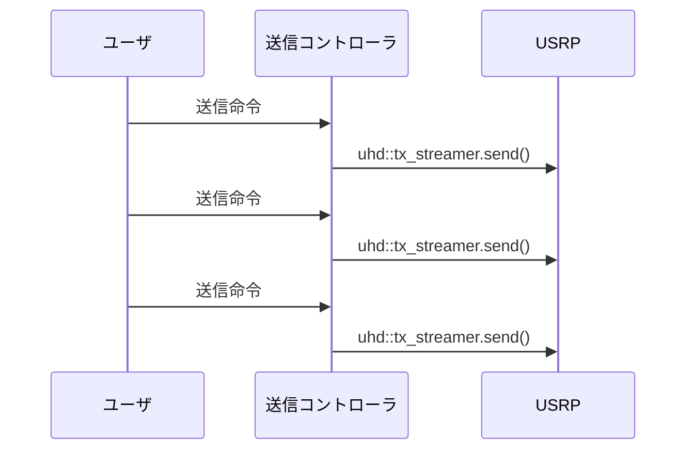

# Ez-SDR(v3)

v3は現在開発中です．
このドキュメントには，一部開発中で未実装のことが書かれています．

## まずは使ってみる

Ez-SDRの環境構築は，このリポジトリをクローンしてDockerイメージをビルドするだけなので簡単です．
Dockerをインストールして，以下のコマンドを実行してみてください．

```sh
$ git clone https://github.com/k3kaimu/Ez-SDR ezsdr
$ cd ezsdr/docker/devenv_uhd4.7
$ docker build -t ezsdr_dev:latest .
$ cd ../v3_prebuild
$ docker build -t ezsdr:latest .
```

これで環境構築は終わりました．
ホスト環境にはlibuhdなどのデバイスドライバ等をインストールする必要はなく，すべて先ほどビルドしたDockerイメージの中に入っています．

それでは，USRP X310から2.4GHzで200 Mspsの速度で，同じ信号を連続して送信してみましょう．
Ez-SDRでは，デバイスとEz-SDR自体の設定をJSONファイルに記述して，それを読み込む必要があります．
USRP X310のIPアドレスが`192.168.10.10`だとしたとき，次のJSONファイルをどこかに保存してください．

```json
{
    "version": 3,
    "devices": {
        "USRP_TX0": {
            "type": "USRP_TX_LoopDRAM",
            "args": "addr0=192.168.10.10",
            "rate": 200e6,
            "freq": 2.4e9,
            "gain": 30,
            "ant": "TX/RX"
        }
    },
    "controllers": {
        "TX0": {
            "type": "LoopTX",
            "devices": ["USRP_TX0"]
        }
    },
    "port": 8888
}
```

この設定ファイルの保存先は現在のディレクトリで，ファイル名は`settings.json`だと仮定して話を進めます．
この設定JSONファイルを読み込んでDocker環境でEz-SDRを起動するためには，以下のコマンドを実行します．

```sh
$ docker run -it --rm --net=host -v $(pwd):/work ezsdr:latest /bundle/usr/bin/ezsdr -c /work/setting.json
```

これでEz-SDRが起動しました．
このあと，実際にUSRPから信号を連続送信するためには，起動したEz-SDRに対して送信命令を発行する必要があります．
ソケット通信を用いてTCP/IPの8888ポートへバイナリ列を送ることでEz-SDRへ命令を送ることができます．

今回の設定で，USRPから信号を送信するためには次のような命令をバイナリ形式でTCP/IPソケットに流し込みます．

```
[0x03, 0x00, 0x54, 0x58, 0x30, 0x00, 0x04, 0x00, 0x00, 0x00, 0x00, 0x00, 0x00, <以降は1024サンブルの複素数のベースバンド信号のバイナリの列．各要素は実部32bit浮動小数点数，虚部32bit浮動小数点数>
```

もしPythonを使うのであれば，TCP/IPでEz-SDRにさきほどの命令を送るのは次のようにします．
Python以外の言語で利用したい場合は，各言語のソケット通信ライブラリを調べて，適宜読み替えてください．

```python
import socket
import numpy as np

s = socket.socket(socket.AF_INET, socket.SOCK_STREAM)
s.connect(("127.0.0.1", 8888))

# "TX0"の長さである"3"を16ビット整数として送信
s.sendall(p.array([3], dtype=np.uint16).tobytes())

# "TX0"を送信
s.sendall(b"TX0")

# 信号長が1024サンプルなので，その情報を64bit整数として送信
s.sendall(p.array([1024], dtype=np.uint64).tobytes())

# txsignalはUSRPから送信する信号で複素数の配列
s.sendall(txsignal.astype(np.complex64).tobytes())
```


## Ez-SDRのアーキテクチャ

Ez-SDRでは，ソフトウェア無線機である「デバイス」と，デバイスを管理・制御する「コントローラ」が登場します． ユーザはコントローラに命令を送ると，その命令をコントローラが実行し，適切にデバイスを制御します．

## デバイス

現在（v3.0.1）のところ，USRP（libuhd）のみに対応しています．

## コントローラ

Ez-SDRでは，デバイスから信号を送受信するためには，コントローラに命令を発行する必要があります．
言い換えると，コントローラがデバイスを制御してくれるので，我々ユーザはコントローラにどのようにデバイスを制御するかを命令します．

たとえば信号を送信したい場合は，下図のようにユーザから送信コントローラに「送信命令」を送ります．
すると，命令を受けたコントローラはデバイスドライバを使い，デバイスに対して信号を送信するようにユーザの代わりに命令を送ります．





