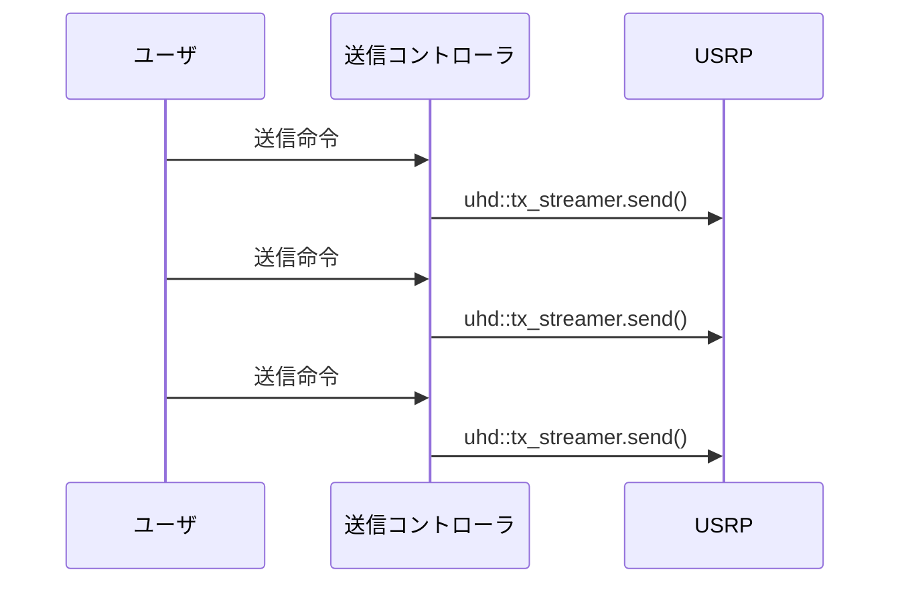

# Ez-SDR(v3)

v3は現在開発中です．
このドキュメントには，一部開発中で未実装のことが書かれています．

## まずは使ってみる

Ez-SDRではビルド済みDockerイメージを配布していますので，Dockerがインストール済みの環境で簡単に試すことができます．
以下のコマンドにより，Ez-SDRのビルド済みのUbuntu環境のイメージをダウンロードすることができます．

```sh
$ docker pull ghcr.io/k3kaimu/ezsdr:latest
```

これで環境構築は終わりました．
ホスト環境にはlibuhdなどのデバイスドライバ等をインストールする必要はなく，すべて先ほどビルドしたDockerイメージの中に入っています．

それでは，USRP X310から2.4GHzで200 Mspsの速度で，信号を連続して繰り返し送信してみましょう．
Ez-SDRでは，ソフトウェア無線デバイスとEz-SDR自体の設定をJSONファイルに記述して，それを読み込む必要があります．
USRP X310のIPアドレスが`192.168.10.10`だとしたとき，次のJSONファイルをどこかに保存してください．

```json
{
    "version": 3,
    "devices": {
        "USRP0": {
            "type": "MultiUSRP",
            "mode": "TX",
            "args": "addr0=192.168.44.34,send_frame_size=9000",
            "tx-subdev": ["A:0"],
            "tx-channels": [
                {
                    "for-channels": [0],
                    "rate": 100e6,
                    "freq": 2.4e9,
                    "gain": 30,
                    "ant": "TX/RX"
                }
            ],
            "tx-streamers": [ { "channels": [0] } ]
        }
    },
    "controllers": {
        "TX0": {
            "type": "CyclicTX",
            "streamers": ["USRP0:TX:0"],
            "syncmode": "USRP"
        }
    },
    "port": 8888
}
```

以降は，この設定ファイルの保存先は現在のディレクトリで，ファイル名は`settings.json`だと仮定して話を進めます．
この設定JSONファイルを読み込んでDocker環境でEz-SDRを起動するためには，以下のコマンドを実行します．

```sh
$ cat settings.json | docker run -i --rm --init --net=host ghcr.io/k3kaimu/ezsdr:latest
```

これでEz-SDRが起動しました．
このあと，実際にUSRPから信号を連続送信するためには，起動したEz-SDRに対して送信命令を発行する必要があります．
ソケット通信を用いてTCP/IPの8888ポートへバイナリ列を送ることでEz-SDRへ命令を送ることができます．

今回の設定で，USRPから1024サンプルの信号を連続して送信するためには次のような命令をバイナリ形式でTCP/IPソケットに流し込みます．

```
[0x03, 0x00, 0x54, 0x58, 0x48, 0x10, 0x00, 0x04, 0x00, 0x00, 0x00, 0x00, 0x00, 0x00, <以降は1024サンブルの複素数のベースバンド信号のバイナリの列．各要素は実部32bit浮動小数点数，虚部32bit浮動小数点数>
```

もしPythonを使うのであれば，TCP/IPでEz-SDRにさきほどの命令を送るのは次のようにします．

```python
import socket
import numpy as np

s = socket.socket(socket.AF_INET, socket.SOCK_STREAM)
s.connect(("127.0.0.1", 8888))

def sendMessage(sock, target, message):
    target = target.encode(encoding="utf-8")
    sock.sendall(len(target).to_bytes(2))           # 命令設定先の文字数（バイト数）
    sock.sendall(target)                            # 命令設定先
    sock.sendall(len(message).to_bytes(8))          # 命令の長さ（バイト数）
    sock.sendall(message)                           # 命令本体

def sendCommand(sock, target, cmdid, cmdbin, options):
    msg = len(options).to_bytes(8)                  # コマンドオプションのバイト数
    msg += options                                  # コマンドオプションの実体
    msg += cmdid.to_bytes(1)                        # 命令の識別子
    msg += cmdbin                                   # 命令の中身
    sendMessage(sock, target, msg)

# 送信信号は今回はとりあえず全部1で，長さは1024サンプルとする
txsignal = np.ones(1024)

# 送信信号を設定する
sendCommand(s, "TX0", 0b00010000, len(txsignal).to_bytes(8) + txsignal.astype(np.complex64).tobytes(), 0b'')

# 設定した信号の送信を開始する
sendCommand(s, "TX0", 0b00010001, 0b'', 0b'')
```

Python以外の言語で利用したい場合は，各言語のソケット通信ライブラリを調べて，適宜読み替えてください．


## Ez-SDRのアーキテクチャ

Ez-SDRでは，ソフトウェア無線機である「デバイス」と，そのデバイスで送受信する処理を抽象化する「ストリーマ」と，ストリーマを管理・制御する「コントローラ」が登場します．
この三つの中で，「デバイス」が最も抽象化レイヤーが低く，その次に「ストリーマ」，さらにその次に「コントローラ」が抽象化レイヤーが高いです．
ユーザはコントローラに命令を送ると，その命令をコントローラがストリーマを使って実行し，適切にストリーマはデバイスドライバを用いてデバイスを制御します．

## デバイス

現在（v3.0.1）のところ，USRP（libuhd）のみに対応しています．

## ストリーマ

USRPやHackRF，BladeRFなどさまざまなソフトウェア無線機がありますが，そのソフトウェア無線機ごとに送受信するためのコード・プログラムは異なります．
それらを抽象化するためのレイヤとして，Ez-SDRでは「ストリーマ」という抽象化レイヤを作成しています．

## コントローラ

Ez-SDRでは，ソフトウェア無線機であるデバイスから信号を送受信するためには，コントローラに命令を発行して，デバイスの送受信機能を抽象化したストリーマを制御してもらう必要があります．
言い換えると，コントローラがストリーマを介してデバイスを制御してくれるので，我々ユーザはコントローラにどのようにストリーマを制御するかを命令します．

たとえば信号を送信したい場合は，下図のようにユーザから送信コントローラに「送信命令」を送ります．
すると，命令を受けたコントローラはストリーマを介してデバイスドライバを使い，デバイスに対して信号を送信するようにユーザの代わりに命令を送ります．



```mermaid
sequenceDiagram
    participant ユーザ
    participant 送信コントローラ
    participant USRP
    ユーザ->>送信コントローラ: 送信命令
    送信コントローラ->>USRP: uhd::tx_streamer.send()
    ユーザ->>送信コントローラ: 送信命令
    送信コントローラ->>USRP: uhd::tx_streamer.send()
    ユーザ->>送信コントローラ: 送信命令
    送信コントローラ->>USRP: uhd::tx_streamer.send()
```

## 抽象化の理由

このように「デバイス」・「ストリーマ」・「コントローラ」と抽象化レイヤーをわざわざ三層にしているのは理由があります．

まず，各デバイスのデバイスドライバを抽象化するのが「デバイス」抽象化の目的です．
たとえば，USRPはlibuhdを用いて制御をしますが，libuhdを抽象化するのが「デバイス」抽象化の目的です．
様々なソフトウェア無線機（USRP, HackRF, BladeRFなど）がありますが，結局は送受信周波数を設定したり，送受信のゲインを設定したり，などの設定項目は実は同じだったりします．
そのため，ユーザーから見たときにこれらが同じように操作できるようにするのが「デバイス」抽象化です．

次に，デバイスが変わっても同じプログラムが使えるようにすることが「ストリーマ」抽象化の目的です．
USRPもHackRFもBladeRFも，極端な話，複素数のIQ信号を送信・受信できるという点では全く同じです．
「ストリーマ」は，このように「IQ信号を送受信できる」という機能を抽象化していますので，USRPでもHackRFでもBladeRFでも同じようにプログラムを組むことができます．

最後に，「コントローラ」は「ストリーマ」の制御をユーザーから隠蔽するレイヤーです．
例えば高いサンプリングレートが要求される状況では，「ストリーマ」の制御は難しくなることもあります．
このような問題をなるべくユーザーから隠蔽するのが「コントローラ」です．
信号をずっとループ送信するとか，信号をずっと受信し続けるとか，ソフトウェア無線機を使って実現したいことは実はあまりバリエーションがありませんので，「コントローラ」はそれらをユーザーが簡単に実現できるように隠蔽しています．
